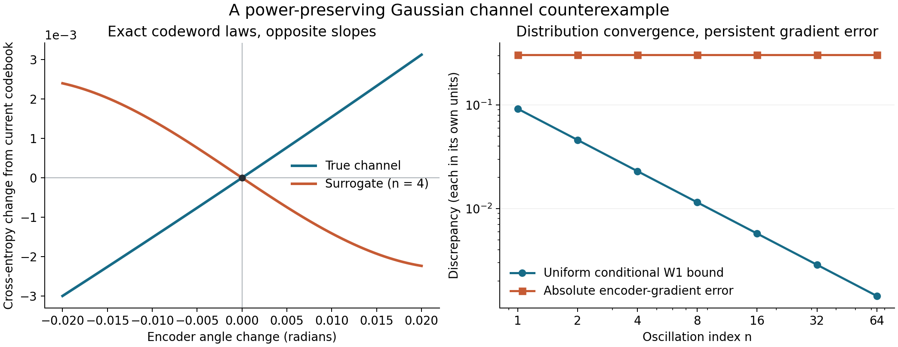

# Distribution fidelity, communication risk, and transmitter gradients

Research note, 9 October 2026. Companion to the [resubmission handover](resubmission_handover.md), [cluster plan](resubmission_cluster_plan.md), and [manuscript plan](resubmission_manuscript_plan.md).

**Main conclusion.** There is a precise gap between matching channel-output distributions and supplying useful transmitter-training gradients. We can prove it even for smooth Gaussian channel families, unit-power codewords, arbitrarily small **uniform conditional** Wasserstein error, and exact distribution matching at the current codebook. However, conditional population SWD does provide downstream consistency under suitable assumptions. The defensible contribution is to identify the missing conditions and test their practical importance, rather than claim that SWD is intrinsically unrelated to communication performance.

**Status.** Sections 2–8 contain mathematical statements with self-contained proofs or explicitly identified standard facts. They do not establish what caused the existing experiments. The protocol and correction in Sections 10–11 are proposals. No cluster experiments were run for this note. The literature search establishes relevant precedents, not exhaustive novelty clearance. No theorem here proves that Sinkhorn drifting has more faithful input gradients than diffusion, flow matching, or another generator.

## 1. Precisely which quantities are being compared?

Let the finite message set be \(\mathcal M\), with probabilities \(\pi_m>0\) summing to one. Let \(e_\phi:\mathcal M\to U\subseteq\mathbb R^k\) be an encoder. A channel is a Borel probability kernel \(x\mapsto P_x\) on \(\mathbb R^d\); its learned replacement is \(x\mapsto Q_x\). Unless stated otherwise, each output law has a finite first moment. These are **channel simulators**, learning \(P(dy\mid x)\); receiver-side channel estimation from pilots is a different task.

For decoder parameters \(\psi\), let \(\ell_\psi(m,y)\) be the training loss, and define

\[
J_P(\phi,\psi)=\sum_m\pi_m\int\ell_\psi(m,y)P_{e_\phi(m)}(dy),
\qquad
J_Q(\phi,\psi)=\sum_m\pi_m\int\ell_\psi(m,y)Q_{e_\phi(m)}(dy).
\]

Hard-decision SER uses a separate loss \(\mathbf1\{D_\psi(y)\ne m\}\). A theorem for smooth cross-entropy is not automatically a theorem for SER.

Use normalized uniform surface measure \(\sigma_d\) on \(\mathbb S^{d-1}\), and define

\[
SW_1(P,Q)=\int_{\mathbb S^{d-1}}W_1(v_\#P,v_\#Q)\,\sigma_d(dv),
\quad v_\#P=\operatorname{Law}(v^TY),\ Y\sim P.
\]

The following objects answer different questions:

| Quantity | What it measures | Main missing information |
| --- | --- | --- |
| \(SW_1(\int P_x\mu(dx),\int Q_x\mu(dx))\) | Unlabeled output mixtures under an input law \(\mu\) | Which output belongs to which input/message |
| \(\int SW_1(P_x,Q_x)\mu(dx)\) | Average conditional distribution error at evaluation inputs | Coverage of deployed codewords and neighborhoods |
| \(\sum_m\pi_mSW_1(P_{e_\phi(m)},Q_{e_\phi(m)})\) | Conditional error at a specified codebook | Decoder sensitivity; change of the channel law with input |
| \(|J_P-J_Q|\) or SER discrepancy | Value of a specified downstream task | Derivative of that value as the transmitter changes |
| \(\nabla_x E_{P_x}\ell_\psi-\nabla_x E_{Q_x}\ell_\psi\) | Expected task-gradient error | Its effect after encoder parameterization, optimizer, and sampling noise |

The repository's `conditional_drifting/metrics.py:sliced_wasserstein_distance_torch` averages absolute projected quantile differences: its population analogue is **order-one** sliced Wasserstein, not \(SW_2\). It uses finitely many random directions (default 256; decoder diagnostics default 128). With equal cloud sizes of at least two, its quantile grid gives empirical one-dimensional \(W_1\); unequal cloud sizes use interpolated quantile quadrature. The population statements below do not certify that finite estimator. Its special branch for fewer than two samples is not the same sliced statistic.

## 2. Global output SWD can be zero for the wrong channel

**Proposition 1 — label reversal.** Let \(M\) be uniform on \(\{-1,+1\}\), \(X=aM\), \(a,\sigma>0\), and

\[
P_x=\mathcal N(x,\sigma^2),\qquad Q_x=\mathcal N(-x,\sigma^2).
\]

Their output marginals are identical, so every output-only distribution distance is zero. Nevertheless, for \(D(y)=\operatorname{sign}(y)\),

\[
R_P(D)=\Phi(-a/\sigma),\qquad R_Q(D)=\Phi(a/\sigma).
\]

The Bayes decoder trained on \(Q\) is \(-\operatorname{sign}(y)\); deploying it on \(P\) gives error \(\Phi(a/\sigma)\), approaching one at high SNR.

**Proof.** Both marginals equal \(\tfrac12\mathcal N(a,\sigma^2)+\tfrac12\mathcal N(-a,\sigma^2)\). Under the true channel, \(MY\) has law \(a+\sigma Z\); under the surrogate it has law \(-a+\sigma Z\), for standard normal \(Z\). The claimed errors and Bayes rules follow. Ties have probability zero. \(\square\)

This is loss of input/label association, not a defect specific to slicing. Exact matching of the **joint** law of \((X,Y)\) would identify the conditional laws \(\mu\)-almost everywhere; matching the output marginal does not.

Even conditional SWD need not rank fixed-receiver task errors. In two dimensions take true means \(mae_1\), isotropic Gaussian noise, and decoder \(\operatorname{sign}(y_1)\). Surrogate A shifts both means by \(be_2\); surrogate B changes the means to \(m(a-c)e_1\), where \(b>c>0\) and \(c<a\). A leaves this decoder's risk unchanged; B increases its error from \(\Phi(-a/\sigma)\) to \(\Phi(-(a-c)/\sigma)\), despite B having smaller conditional SWD. Indeed translated laws satisfy

\[
SW_1(P,P(\cdot-\delta))=\kappa_d\|\delta\|,
\qquad \kappa_d=\int|v^Te_1|\,\sigma_d(dv),\quad\kappa_2=2/\pi.
\]

To verify the identity, each projected law is translated by \(v^T\delta\), whose one-dimensional transport cost is exactly its absolute value. This example concerns **fixed-decoder risk discrepancy**; it is not by itself a claim about the error after retraining an optimal decoder.

## 3. What conditional SWD does guarantee

### 3.1 Population consistency in fixed dimension

**Proposition 2.** For fixed \(P\in\mathcal P_1(\mathbb R^d)\) and \(Q_n\in\mathcal P_1(\mathbb R^d)\),

\[
SW_1(P,Q_n)\to0\quad\Longleftrightarrow\quad W_1(P,Q_n)\to0.
\]

**Proof.** Rotational invariance gives \(\int|v^Ty|\,d\sigma_d(v)=\kappa_d\|y\|\), with \(\kappa_d>0\). Since absolute value is 1-Lipschitz,

\[
\kappa_d\left|E_{Q_n}\|Y\|-E_P\|Y\|\right|\le SW_1(P,Q_n).
\]

Thus the radial first moments converge and are bounded, giving tightness. For any weakly convergent subsequence \(Q_{n_j}\Rightarrow Q_*\), lower semicontinuity of transport cost under weak convergence of the projected laws, followed by Fatou's lemma, gives \(SW_1(P,Q_*)=0\). The first moment of \(Q_*\) is finite by lower semicontinuity. The projected laws agree for almost every direction. Their characteristic functions then agree in all directions by continuity and density of a full-surface-measure set. Uniqueness of characteristic functions gives \(Q_*=P\). Hence \(Q_n\Rightarrow P\). The standard characterization of \(W_1\) convergence by weak convergence plus convergence of first absolute moments finishes this direction.

Conversely, project any coupling, average its cost over the sphere, and then minimize the original coupling cost to obtain \(SW_1(P,Q)\le\kappa_d W_1(P,Q)\). \(\square\)

For a **fixed finite codebook** with positive priors, convergence of averaged conditional population \(SW_1\) forces every codeword's conditional \(W_1\) to converge. This does not assert a useful finite-error rate, a dimension-uniform result, uniformity over changing encoders, or consistency from a fixed number of sampled projections.

Quantitative reverse comparisons depend on assumptions and dimension. Recent work studies sharp rates for compactly supported laws; Gaussian outputs here are unbounded, so its compact-support theorem cannot be imported unchanged. This note does not rely on that external theorem. [Carlier, Figalli, Mérigot and Wang, *Sharp comparisons between sliced and standard 1-Wasserstein distances*](https://arxiv.org/abs/2510.16465).

### 3.2 Smooth losses and hard decisions need different assumptions

Write \(P_m=P_{x_m}\), \(Q_m=Q_{x_m}\), and \(\varepsilon=\sum_m\pi_mW_1(P_m,Q_m)\).

**Proposition 3 — loss transfer.** If each \(y\mapsto\ell_\psi(m,y)\) is \(L_\ell\)-Lipschitz, then

\[
|J_P-J_Q|\le L_\ell\varepsilon.
\]

**Proof.** Under an optimal coupling \((Y,\widehat Y)\) for each message, \(|E\ell(Y)-E\ell(\widehat Y)|\le L_\ell E\|Y-\widehat Y\|\). Average over messages. Finite first moments ensure integrability. \(\square\)

For SER, let \(A_m=\{y:D(y)=m\}\) and \(B_m=\partial A_m\), for a deterministic measurable decoder. Empty boundaries are handled with distance \(+\infty\). For every \(r>0\),

\[
|R_P(D)-R_Q(D)|\le
\underbrace{\sum_m\pi_mP_m\{\operatorname{dist}(Y,B_m)\le r\}}_{\text{true probability near a decision boundary}}
+\frac{\varepsilon}{r}.
\tag{1}
\]

**Proof.** If two coupled observations have different membership in \(A_m\), either the true observation is within \(r\) of its boundary or their displacement exceeds \(r\). Otherwise their joining segment stays in a ball disjoint from the boundary, throughout which membership is constant. Apply Markov's inequality to the displacement and average. \(\square\)

If boundary mass is at most \(Cr^\alpha\) for \(0<r\le r_0\), (1) gives \(\inf_{0<r\le r_0}(Cr^\alpha+\varepsilon/r)\). In particular, for \(\alpha=1\) and \(\sqrt{\varepsilon/C}\le r_0\), the bound is \(2\sqrt{C\varepsilon}\). For any fixed decoder with \(P_m(B_m)=0\), conditional \(W_1\to0\), and hence conditional population \(SW_1\to0\), imply SER convergence.

The boundary condition cannot be dropped. Let the positive message output be exactly zero, the negative message output exactly \(-1\), and decode \(y\ge0\) as positive. Moving only the positive output to \(-1/n\) gives average conditional \(W_1=1/(2n)\to0\), but changes equiprobable-message SER from zero to \(1/2\).

The square-root rate is also meaningful: if a positive-message output is uniform on \((0,1)\), reflecting its part in \((0,r)\) to \((-r,0)\) changes its error by \(r\) while its \(W_1\) cost is exactly \(r^2\). The reflection coupling achieves that cost; the change of means gives the matching lower bound.

### 3.3 Global optimization can transfer without gradient fidelity

**Proposition 4.** For any encoder/decoder class \(\Theta\), suppose losses are finite, \(\inf_\Theta J_P> -\infty\), and

\[
\sup_{\theta\in\Theta}|J_P(\theta)-J_Q(\theta)|\le\delta.
\]

If \(J_Q(\widehat\theta)\le\inf_\Theta J_Q+\eta\), then

\[
J_P(\widehat\theta)-\inf_\Theta J_P\le2\delta+\eta.
\tag{2}
\]

**Proof.** Insert \(J_Q(\widehat\theta)\) and \(\inf J_Q\) between the two true objectives and apply the uniform bound twice. No attained minimum is needed. \(\square\)

Uniform conditional \(W_1\le\varepsilon\) over all admissible transmitted inputs, together with a common loss Lipschitz constant over the decoder class, gives \(\delta=L_\ell\varepsilon\). Such uniformity is stronger than a validation average. Equation (2) also assumes an approximate **global** surrogate optimum, not a guarantee delivered by neural-network SGD. Input-gradient fidelity addresses local optimization and computational attainability; it is not logically necessary for (2). For uniform SER transfer, the margin condition must also hold across the relevant competing decoders.

## 4. Average conditional fidelity can miss the deployed codebook

**Counterexample — smooth but uncovered inputs.** Let the anchor law be \(\mu=\mathcal N(0,1)\), and \(P_x=\mathcal N(x,\sigma^2)\). Fix \(a>0\), take a smooth bump \(0\le\psi\le1\), supported in \([-1,1]\), with \(\psi(0)=1\), and set, for \(0<h<a\),

\[
Q_{h,x}=\mathcal N\!\left(x-2a\psi((x-a)/h)+2a\psi((x+a)/h),\sigma^2\right).
\]

The bumps have disjoint support. With \(\rho\) the anchor density, translation coupling and the mean lower bound give

\[
\int W_1(P_x,Q_{h,x})\mu(dx)\le8ah\|\rho\|_\infty\to0.
\]

Yet \(Q_{h,a}=P_{-a}\) and \(Q_{h,-a}=P_a\): the deployed BPSK codebook is reversed for every \(h\). In one dimension \(SW_1=W_1\). All these conditional mean functions are smooth, but their derivative bounds are not uniform in \(h\).

A finite codebook's atomic distribution is not absolutely continuous with respect to a Gaussian anchor law. An average under the latter therefore does not automatically bound the former. Directly evaluating codewords and neighborhoods is essential.

**Positive coverage bound.** If the two conditional families are respectively \(L_P,L_Q\)-Lipschitz in \(W_1\), let \(L_x=L_P+L_Q\) and \(e(x)=W_1(P_x,Q_x)\). Then \(e\) is \(L_x\)-Lipschitz by triangle inequalities. If every admissible \(x\) satisfies \(\mu(B(x,r))\ge cr^k\) for \(0<r\le r_0\), and \(\bar\varepsilon=\int e\,d\mu\),

\[
\sup_x e(x)\le\inf_{0<r\le r_0}\left(\frac{\bar\varepsilon}{cr^k}+L_xr\right).
\tag{3}
\]

Indeed, average \(e(z)\ge e(x)-L_xr\) on the ball and divide by its probability. For Gaussian anchors, a uniform positive lower-mass constant exists on a specified compact input domain, not globally on \(\mathbb R^k\). The power convention must justify the domain; with finitely many messages and fixed positive priors, a deterministic bound on average codeword energy also bounds each codeword by its prior-weighted energy budget.

## 5. Exact codeword distributions can give the opposite transmitter gradient

This is the strongest obstruction. Unlike Section 4, it persists with uniformly accurate conditional laws **everywhere** and a uniform first-derivative bound.

**Proposition 5 — fixed-power Gaussian counterexample.** Fix \(\sigma,\kappa>0\), and equiprobable binary messages. Consider unit-energy codewords

\[
e_t(m)=m(\cos t,\sin t),\qquad t_0=\pi/6.
\]

For every integer \(n\ge1\), put \(A=2/\sqrt3\), \(\omega_n=4\pi n\), and

\[
P_x=\mathcal N(x,\sigma^2 I_2),\qquad
Q_{n,x}=\mathcal N\!\left(H_n(x),\sigma^2 I_2\right),
\quad
H_n(x)=x+\frac{A}{\omega_n}\sin(\omega_n x_2)e_1.
\tag{4}
\]

Use a fixed logistic decoder loss \(\ell(m,y)=\log(1+\exp(-\kappa m y_1))\) and hard decoder \(D(y)=\operatorname{sign}(y_1)\). Then:

1. Every codeword has exactly unit energy for every \(t\).
2. For every finite \(p\ge1\),
   \[
   \sup_{x\in\mathbb R^2}W_p(P_x,Q_{n,x})\le A/\omega_n\to0.
   \]
   Also \(\sup_x\mathrm{KL}(P_x\Vert Q_{n,x})\le A^2/(2\sigma^2\omega_n^2)\to0\).
3. The complete conditional laws match at both current codewords: \(Q_{n,e_{t_0}(m)}=P_{e_{t_0}(m)}\). Every population codeword distribution discrepancy is exactly zero there.
4. Nevertheless, \(J_{Q_n}'(t_0)=-J_P'(t_0)\ne0\).
5. For each fixed \(n\), a sufficiently small positive surrogate gradient-descent step decreases surrogate cross-entropy while strictly increasing both true cross-entropy and true BER.

**Proof.** Unit energy is immediate. Gaussian laws with the same covariance and mean difference \(\delta\) have \(W_p=\|\delta\|\): sharing the Gaussian noise attains this cost, and Jensen's inequality applied to any coupling gives the matching lower bound. Their KL divergence is \(\|\delta\|^2/(2\sigma^2)\). At \(t_0\), the second coordinates are \(\pm1/2\), so the sine term in (4) vanishes.

Let \(Z\sim\mathcal N(0,1)\), and write

\[
r(s)=E\log(1+\exp[-\kappa(s+\sigma Z)]),\qquad
a_n(t)=\cos t+\frac A{\omega_n}\sin(\omega_n\sin t).
\]

Symmetry of the Gaussian noise and oddness of the mean map give

\[
J_P(t)=r(\cos t),\qquad J_{Q_n}(t)=r(a_n(t)).
\]

Differentiation under expectation is justified by the bound on the logistic derivative, and

\[
r'(s)=-\kappa E\frac{1}{1+\exp(\kappa(s+\sigma Z))}<0.
\]

At \(t_0\),

\[
a_n(t_0)=\sqrt3/2,\qquad
a_n'(t_0)=-\frac12+A\frac{\sqrt3}{2}=+\frac12.
\]

Consequently

\[
J_P'(t_0)=-\tfrac12r'(\sqrt3/2)>0,\qquad
J_{Q_n}'(t_0)=+\tfrac12r'(\sqrt3/2)<0.
\tag{5}
\]

A surrogate gradient step sends \(t\) to \(t_0+\eta J_P'(t_0)>t_0\). For small enough \(\eta>0\), it remains below \(\pi/2\); true cross-entropy increases because \(\cos t\) decreases and \(r\) is strictly decreasing. True BER is \(\Phi(-\cos t/\sigma)\), which also strictly increases. For each fixed \(n\), smoothness and a nonzero surrogate derivative ensure that a sufficiently small step decreases the surrogate objective. \(\square\)

**Adversarial audit.** This is stochastic AWGN, a usual smooth classification loss, and a power-preserving encoder direction. Neither incorrect noise variance nor input coverage explains the reversal. Moreover, \(\|DH_n(x)\|_{\rm op}\le1+A\) uniformly in \(n,x\): merely bounding a surrogate's first input derivative is insufficient. Its second derivative has supremum \(A\omega_n\), which diverges. A step guaranteed to decrease the surrogate may therefore shrink with \(n\). We do **not** assert a uniform stable step with a nonvanishing loss increase as the uniform distribution error vanishes; that would conflict with the value bound in Section 3. Exact conditional matching on an open neighborhood, as opposed to finitely many codewords, would imply matching derivatives of the expected loss wherever differentiable.

The decoder is fixed during the transmitter update and is not assumed Bayes-optimal at each candidate encoder. This is the usual local differentiation question in alternating or joint training, holding the other parameter block fixed. If the receiver were optimally readapted at every angle on this isotropic AWGN channel, it could rotate with the codebook, and the true optimum risk would be angle-independent. The construction does not claim otherwise.

The basic mathematical obstruction is convergence of function values without convergence of derivatives. Equation (4) realizes it as a complete communication channel, with exact codeword matching and fixed power. This construction is independently checked here; publication novelty of this particular formulation remains to be established.

## 6. Define gradient fidelity in a representation-independent way

Define the conditional expectation operator \(T_P f(x)=\int f(y)P_x(dy)\), and

\[
b_P(x,m,\psi)=\nabla_xT_P\ell_\psi(m,\cdot)(x),\qquad b_Q\text{ analogously}.
\tag{6}
\]

These are derivatives of an **expected task loss**, not samplewise generator Jacobians. Assume differentiability on an open neighborhood of the evaluated inputs and finite expectations. To compute (6) by pathwise differentiation of \(Y=g_P(x,Z)\), additionally require an input-independent noise law and a valid differentiation-under-expectation argument, for example almost-everywhere differentiability with an integrable local bound on the pathwise loss derivative. Without this justification, autograd need not estimate (6).

When justified,

\[
b_P(x,m,\psi)=E\left[D_xg_P(x,Z)^T\nabla_y\ell_\psi(m,g_P(x,Z))\right].
\]

The product and its expectation matter. Comparing the norms of \(D_xg_P\) and \(D_xg_Q\) alone ignores the decoder and the correlation with its loss derivative. Arbitrary latent coordinates also make samplewise Jacobian matching representation-dependent. For instance, \(g_1(x,Z)=Z_1\) and \(g_2(x,Z)=\cos x\,Z_1+\sin x\,Z_2\), with independent standard normals, have the same constant \(\mathcal N(0,1)\) law for every \(x\), but different samplewise input derivatives. Their expected loss derivatives both vanish whenever differentiation is justified.

For **receiver-only** optimization at a fixed encoder, conditional \(W_1\) does control expected receiver gradients if \(y\mapsto\nabla_\psi\ell_\psi(m,y)\) is uniformly Lipschitz and parameter differentiation is justified: the coupling proof bounds their difference by \(L_g\varepsilon\). No derivative of the channel law with respect to \(x\) is needed. The extra difficulty in (6) arises when optimizing the transmitter.

**Proposition 6 — transfer to encoder parameters.** Freeze \(\psi\); assume the above regularity and differentiability of the power-normalized encoder. Let

\[
D^2=\sum_m\pi_m\|b_P(e_\phi(m),m,\psi)-b_Q(e_\phi(m),m,\psi)\|^2,
\quad
B^2=\sum_m\pi_m\|D_\phi e_\phi(m)\|_{\rm op}^2.
\]

Then

\[
\|\nabla_\phi J_P-\nabla_\phi J_Q\|\le BD.
\tag{7}
\]

**Proof.** The chain rule gives the difference as \(\sum_m\pi_mD_\phi e_\phi(m)^T(b_P-b_Q)\). Apply the triangle inequality, the operator norm bound, and weighted Cauchy–Schwarz. \(\square\)

The encoder Jacobian includes the declared power normalization. Joint codebook normalization can couple messages; (7) remains valid when each \(e_\phi(m)\) is differentiated as a function of the whole parameter vector. It does not justify ignoring that coupling or treating minibatch-dependent codewords as fixed symbols.

## 7. A positive condition: uniform value accuracy plus bounded curvature

**Proposition 7.** Fix a message and decoder. Let \(f_P(x)=T_P\ell(x)\), \(f_Q(x)=T_Q\ell(x)\), and \(g=f_P-f_Q\). Suppose on the closed ball \(\overline B(x,r)\) that \(|g|\le\delta\), that \(g\) is continuously differentiable on a neighborhood of the ball, and that its gradient is \(H\)-Lipschitz on the ball. Then

\[
\|\nabla g(x)\|\le\inf_{0<h\le r}\left(\frac\delta h+\frac{Hh}{2}\right).
\tag{8}
\]

If \(H>0\) and \(\sqrt{2\delta/H}\le r\), this is at most \(\sqrt{2H\delta}\), with the zero-\(\delta\) case interpreted by a limit. If \(H=0\), the bound is \(\delta/r\).

**Proof.** For any unit \(u\), the centered difference \([g(x+hu)-g(x-hu)]/(2h)\) has magnitude at most \(\delta/h\). By the fundamental theorem of calculus and the gradient Lipschitz bound, its difference from \(u^T\nabla g(x)\) is at most

\[
\frac1{2h}\int_{-h}^h H|s|\,ds=Hh/2.
\]

Choose \(u\) parallel to \(\nabla g(x)\), unless that gradient is zero, and optimize over \(h\). \(\square\)

If \(\ell\) is \(L_\ell\)-Lipschitz and conditional \(W_1\le\varepsilon\) throughout this ball, Proposition 3 gives \(\delta=L_\ell\varepsilon\). Thus

\[
\|b_P(x)-b_Q(x)\|\le\sqrt{2H L_\ell\varepsilon}
\tag{9}
\]

when the radius condition holds. One sufficient curvature assumption is separate Lipschitz-gradient bounds \(\beta_P,\beta_Q\), giving \(H=\beta_P+\beta_Q\). This is an elementary value-to-derivative interpolation bound, not a new general principle. The oscillatory counterexample avoids it by having unbounded curvature as \(n\to\infty\). A finite empirical SWD score does not verify the uniform-neighborhood or curvature assumptions.

## 8. What gradient error implies for training

**Proposition 8 — biased descent.** Let \(F(\phi)=J_P(\phi,\psi)\), with fixed decoder. Assume \(F\) has \(L_F\)-Lipschitz gradient on a region containing the update segment, where \(L_F>0\). Put \(g_Q=\nabla_\phi J_Q=\nabla F+b\), and update \(\phi^+=\phi-\eta g_Q\), with \(0<\eta\le1/L_F\). Then

\[
F(\phi^+)\le F(\phi)-\frac\eta2\|\nabla F\|^2
-\frac{\eta(1-L_F\eta)}2\|g_Q\|^2
+\frac\eta2\|b\|^2
\le F(\phi)-\frac\eta2\|\nabla F\|^2+\frac\eta2 B^2D^2.
\tag{10}
\]

**Proof.** The descent lemma bounds the change by \(-\eta\langle\nabla F,g_Q\rangle+L_F\eta^2\|g_Q\|^2/2\). Substitute
\(2\langle\nabla F,g_Q\rangle=\|\nabla F\|^2+\|g_Q\|^2-\|b\|^2\), then use (7). \(\square\)

Thus \(BD<\|\nabla F\|\) is a sufficient true-descent condition. More exactly, infinitesimal movement along \(-g_Q\) decreases the true objective when \(\langle\nabla F,g_Q\rangle>0\). Gradient norm alone cannot distinguish a helpful direction from its negative.

If the same assumptions hold along \(T\) iterates, with constant step and lower bound \(F_*\), summation gives

\[
\frac1T\sum_{t=0}^{T-1}\|\nabla F(\phi_t)\|^2
\le\frac{2(F(\phi_0)-F_*)}{\eta T}
+\frac1T\sum_{t=0}^{T-1}B_t^2D_t^2.
\tag{11}
\]

For a stochastic gradient unbiased **for the surrogate gradient**, with conditional variance at most \(V_t\), conditional expectation adds \(L_F\eta^2V_t/2\) to (10), hence \(L_F\eta\,T^{-1}\sum_t E V_t\) to the expected version of (11). Smoothness must hold on all realized update segments and the relevant quantities must be integrable. This separates systematic surrogate bias from Monte Carlo variance. It does not establish global optimality, a guarantee for Adam, or a direct SER bound. Updating the decoder changes the frozen objective; analyze the combined parameter vector with all gradient components controlled if a joint-training theorem is wanted.

## 9. Literature and the plausible contribution

The general facts that good function values need not give good derivatives, and that a model should be evaluated for the task using it, are established ideas. These primary sources are relevant:

| Source | Verified relevance | What we are not importing |
| --- | --- | --- |
| [Czarnecki et al., *Sobolev Training for Neural Networks*, 2017](https://arxiv.org/abs/1706.04859) | Training with derivative targets as well as function values | A theorem about this stochastic channel kernel or Sinkhorn drifting |
| [Farahmand, Barreto and Nikovski, *Value-Aware Loss Function for Model-based Reinforcement Learning*, 2017](https://proceedings.mlr.press/v54/farahmand17a.html) | Model losses chosen for downstream value estimation | Its RL bounds with unverified channel assumptions |
| [D'Oro et al., *Gradient-Aware Model-Based Policy Search*, 2020](https://ojs.aaai.org/index.php/AAAI/article/view/5791) | A model objective derived from policy-gradient estimation error | Novelty of the general phrase or idea “gradient-aware surrogate” |
| [Jiang et al., *Residual-Aided End-to-End Learning of Communication System Without Known Channel*, TCCN 2022](https://oa.ee.tsinghua.edu.cn/~dailinglong/publications/paper/Residual-aided%20end-to-end%20learning%20of%20communication%20system%20without%20known%20channel.pdf) | Surrogate gradients, vanishing gradients through channel generators, residual connections; Section III and equations (7)–(9) | A proof that output-law matching gives faithful expected-loss derivatives; residual connections alone do not exclude Proposition 5 |
| [*Diffusion Models for Accurate Channel Distribution Generation*](https://arxiv.org/abs/2309.10505) | Direct channel-generation comparator studying SWD, sampling speed, and E2E SER | A new discovery that channel-generation metrics and downstream SER should both be measured |

The most defensible candidate contribution is a **communications-specific separation and sufficient-condition analysis**, followed by a controlled demonstration of when gradient fidelity explains useful or failed transmitter learning, and possibly a correction that works under declared data access and compute. Proposition 5 gives a compact formal centerpiece; Propositions 7–8 give positive conditions and optimization consequences. Place the routine risk/coverage lemmas in an appendix or supporting note.

Do not position the result as “Sinkhorn is theoretically downstream equivalent” or “SWD has no downstream guarantees.” The exact finite-codeword counterexample does not distinguish training algorithms. Independently matching distributions at anchors does not explicitly penalize how the conditional family changes between neighboring inputs; shared networks may regularize that change empirically, but that is a hypothesis.

## 10. Concrete P3 addendum: test mechanism before scaling

Keep the existing common validation/selection protocol. Diagnostic theory does not authorize choosing whichever checkpoint retrospectively looks best on a final downstream test. If a gradient-based selector is proposed, treat it as a separately preregistered selection-method comparison with equal validation budgets.

### Stage T0 — deterministic illustration, no cluster needed

**Completed locally for this note.** The [reproduction script](figures_src/swd_gradient_counterexample.py) evaluates Proposition 5 with \(\sigma=0.5\), \(\kappa=1\), and \(n\in\{1,2,4,8,16,32,64\}\). It uses 128-point Gauss–Hermite quadrature, compares the loss at \(t_0\) with 64-point quadrature, checks centered differences against the derived gradient, and checks true/surrogate loss changes and true BER after steps \(\eta_n=0.2/\omega_n\). All arithmetic checks passed. Agreement to floating-point precision at one quadrature comparison is not a certified integration-error bound. The proof remains the one in Section 5.

For \(n=4\), the uniform \(W_1\) bound is approximately \(0.022972\), the true encoder gradient is \(+0.152906\), and the surrogate gradient is \(-0.152906\). The chosen step changes true CE from \(0.376738\) to \(0.376832\), while surrogate CE falls to \(0.376646\); true BER rises from \(0.0416323\) to \(0.0416865\). These are values of a constructed example, not performance measurements of trained models.

Artifacts: [numerical record](theory_artifacts/swd_gradient_counterexample.json), [PNG](theory_artifacts/swd_gradient_counterexample.png), [vector SVG](theory_artifacts/swd_gradient_counterexample.svg). Reproduce with `python Journal_version/figures_src/swd_gradient_counterexample.py` in an environment containing NumPy and Matplotlib. No new dependencies were installed; the local run used the existing neighboring `DM_for_learning_channels` Python environment because the bundled document runtime lacked Matplotlib.

### Stage T1 — common checkpoint diagnostics

Start with AWGN and SSPA, three development generator seeds, and three common early/middle/late checkpoints of an analytic-trained reference AE. Reuse saved generators where compatible with the revised power/noise contracts; otherwise regenerate them. All surrogates see the same frozen encoder, decoder, labels, SNR, and codebook. This is a diagnostic panel, not a newly independent generator replicate for every decoder checkpoint.

1. Measure global and conditional SWD; separate Gaussian anchors, actual codewords, and perturbed codeword neighborhoods.
2. Reuse `evaluate_decoder_channel_metrics` for confusion-row TV, per-message SER differences, cross-entropy, and decoder margins. These are already implemented in `conditional_drifting/symbolic_ae.py`.
3. Add a **separate** expected-loss gradient evaluator; the existing decoder diagnostic has `@torch.no_grad()`. Freeze generator and decoder parameters while preserving gradients with respect to inputs. Start with 4096 noise samples per selected message and four independent replicates, then use analytic-versus-analytic variability to assess whether this resolves the signal.
4. Report \(D\) from (7), absolute parameter-gradient bias, true/surrogate gradient norms, inner product, and cosine only above a predeclared reference-noise threshold. A nearly zero reference gradient makes relative errors and cosine unstable. Estimate mean-gradient error separately from within-model sample-gradient variance; finite-sample squared differences are upward biased by estimator noise.
5. For a subset, compare expected pathwise gradients with centered finite differences of expected loss at step sizes \(h/2,h,2h\). Reuse random numbers within each simulator across the paired perturbations when supported. Identical numeric seeds across different latent parameterizations do not establish a meaningful cross-model coupling.
6. Record the complete power-normalization derivative and both raw-input and encoder-parameter gradients. Probability/logit margin diagnostics are useful, but they are **not** the Euclidean boundary distance in (1) without an additional geometric bound.

### Stage T2 — controlled interventions

Use matched initializations and held-out analytic evaluation. Initially use plain SGD for one-step interventions so that (10) has the same update rule; retain the actual optimizer in the separate full-training performance experiment.

| Experiment | Fixed elements | Changed element | What it can resolve |
| --- | --- | --- | --- |
| Receiver-only training | Encoder and channel sampler | Surrogate supplying receiver data | Distribution/decision-region effects without input backpropagation |
| Encoder-only training | Common decoder and initialization | Channel supplying encoder gradients | Whether biased input gradients affect transmitter progress |
| Matched one-step intervention | Same encoder, decoder, step size, normalization | Surrogate gradient versus a high-accuracy analytic expected gradient | Predicted versus actual true-loss change, with minimal trajectory confounding |
| Joint AE training | Full protocol, paired initializations | Surrogate channel | Practical performance, with interacting effects acknowledged |

At the same frozen state, the true-gradient update is a diagnostic oracle, not a deployable free baseline. Evaluate the predicted first-order change \(-\eta\langle\nabla J_P,\nabla J_Q\rangle\) and actual analytic-channel CE/SER after the step. Use independent evaluation noise or predeclared pairing and confidence intervals. If using a stop-gradient backward replacement, describe exactly what forward outputs and expected gradient are retained; simply substituting a true samplewise channel Jacobian while keeping unrelated surrogate outputs does **not** generally give the true expected task gradient.

These interventions are stronger evidence than a correlation between SWD and final SER. They can still fail to explain long-run outcomes: decoder adaptation, gradient variance, coverage drift, and optimizer dynamics remain alternative causes. Expand to the larger structured channel and confirmatory seeds only if the pilot reveals a stable, practically relevant effect.

### Required diagnostic records

Extend `gradient_metrics.csv` from the cluster plan with generator/AE checkpoint hashes, generator seed, decoder ID, message, codeword and neighborhood ID, SNR/noise/power contracts, gradient sample count and replicate, mean gradients, covariance or variance summaries, norm threshold, directional derivative, step size, and analytic loss/error counts before and after each intervention. Record total diagnostic and oracle cost separately. Reuse the established nested-seed analysis; messages, directions, and Monte Carlo draws are not independent trained-model replicates.

## 11. A possible correction, conditional on the pilot

Define a task-gradient penalty for a predeclared distribution \(\rho\) over inputs, labels, and frozen decoder tasks:

\[
\mathcal R_{\rm grad}(Q)
=E_{(x,m,\psi)\sim\rho}\|b_Q(x,m,\psi)-b_P(x,m,\psi)\|^2.
\tag{12}
\]

Use it alongside a properly specified conditional distribution objective, with weights frozen by development validation. This targets derivatives of the conditional expectation operator, avoiding arbitrary latent sample matching. Directional versions may reduce cost, but the scaling and set of tested directions must be declared. Training through \(b_Q\) can require higher-order automatic differentiation; account for it.

Analytic differentiable simulators provide pathwise targets. With only repeated black-box queries, finite differences can target directional derivatives of expected loss. For independent noisy loss estimates with bounded variance, the variance generally scales as \(O(1/(Kh^2))\), while finite-difference bias depends on local regularity. Common random numbers may reduce variance only if the simulator exposes a valid shared-noise interface. Repeatable output sampling at a fixed input does not automatically provide that interface.

Include several frozen decoder tasks and held-out decoders/codebooks. Otherwise a generator could preserve one chosen decoder's gradients while worsening its use as a general channel simulator. Compare at equal simulator-query and measured compute budgets, and disclose privileged derivative access. Do not claim that (12) has been implemented or validated; the first deliverable is T1/T2 evidence that this target matters.

## 12. Claims to keep, and claims to reject

| Claim | Status |
| --- | --- |
| Unlabeled output distribution matching can miss the channel's input/output association completely | Proved, Proposition 1 |
| Conditional population \(SW_1\to0\) cannot imply downstream consistency | False in general as stated; Proposition 2 plus appropriate loss/margin assumptions gives consistency |
| Smaller finite conditional SWD must rank all decoder risks correctly | False; orthogonal versus decision-directed shifts give a counterexample |
| Accurate conditional laws at the current codewords guarantee faithful transmitter gradients | False; Proposition 5 |
| Arbitrarily small uniform conditional \(W_p\), even Gaussian KL, guarantees input-gradient convergence without further regularity | False; Proposition 5 |
| Uniform value accuracy plus uniform local curvature controls task-gradient error | Proved under Proposition 7's radius and smoothness assumptions |
| Expected task-gradient bias controls true local descent under explicit smoothness and step-size assumptions | Proved, Propositions 6 and 8 |
| Faithful input gradients are necessary for approximate global-optimum transfer | False under uniform objective approximation; Proposition 4 suffices without them |
| Sinkhorn drifting's empirical advantage or failure is caused by gradient fidelity | Open empirical hypothesis |
| A derivative-aware correction improves performance per time | Open empirical hypothesis; measure its extra data and compute |

For the journal, prioritize Proposition 5, the positive bound (9), and the descent connection (10), accompanied by the controlled diagnostic. Their scientific value depends on explaining an observed and reproducible communications phenomenon. The general mathematical tools and prior gradient-aware work must be credited; the existing manuscript should not be presented as having already established this contribution.
